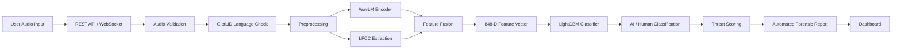
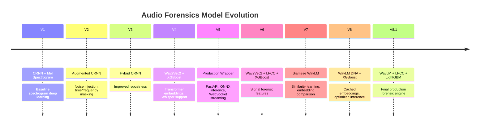
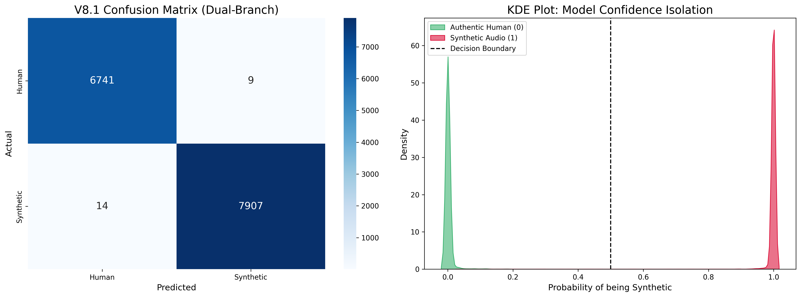

<div align="center">

# 🎙️ Audio Forensics
### AI for Voice Security

**A production-grade AI system for detecting synthetic speech, voice cloning, and AI-generated voice attacks — in real time.**


</div>

---

## 📖 Overview

**Audio Forensics** is an AI-powered voice security platform built to detect synthetic speech, AI-generated voices, and voice cloning attacks.

The system evolved through **8+ model generations** — moving from spectrogram-based deep learning to a production forensic engine that fuses:

- 🧬 Transformer speech representations
- 🔬 Signal-processing forensic features
- 🧩 Siamese similarity learning
- 🌲 Ensemble machine learning
- ⚡ Real-time WebSocket inference

### Key Capabilities

| Capability | Description |
|---|---|
| ✅ Static Forensic Analysis | Deep analysis of uploaded audio recordings |
| ✅ Real-Time Interception | Live voice stream monitoring via WebSocket |
| ✅ AI Speech Detection | Identifies AI-generated and cloned voices |
| ✅ Threat Scoring | Quantified risk assessment per analysis |
| ✅ Automated Forensic Reports | Structured, actionable security output |

---

## 📑 Table of Contents

- [Live Deployments](#-live-deployments)
- [System Architecture](#-system-architecture)
- [Model Evolution](#-model-evolution)
- [Dataset & Model Download](#-dataset--model-download)
- [Dataset Intelligence](#-dataset-intelligence)
- [Language Identification (GlotLID)](#-language-identification-glotlid)
- [Synthetic Voice Generation Pipeline](#-synthetic-voice-generation-pipeline)
- [Audio Preprocessing](#-audio-preprocessing)
- [Feature Extraction](#-feature-extraction)
- [Data Augmentation](#-data-augmentation)
- [Testing & API Usage](#-testing--api-usage)
- [Frontend](#-frontend)
- [Threat Intelligence Report](#-threat-intelligence-report)
- [Performance](#-performance)
- [Technology Stack](#-technology-stack)
- [Security Practices](#-security-practices)
- [Notes](#-notes)
- [Contributors](#-contributors)
- [License](#-license)
- [Links](#-links)

---

## 🚀 Live Deployments

### Google Cloud Run — *Primary Production Deployment (archived)*

```
https://threat-engine-v8-810126162948.us-central1.run.app/
```

**Stack:** Docker · FastAPI · PyTorch · WavLM · Whisper · LightGBM · Google Cloud Container Registry

📄 **Code:** [`Dockerfile`](https://github.com/venkatasriramt-spec/AI-Voice-Forensics/blob/main/Backend/V_8_1_Production/V_8_1_Cloud_Run_Deployment/Dockerfile) · [`main.py`](https://github.com/venkatasriramt-spec/AI-Voice-Forensics/blob/main/Backend/V_8_1_Production/V_8_1_Cloud_Run_Deployment/main.py) · [`requirements.txt`](https://github.com/venkatasriramt-spec/AI-Voice-Forensics/blob/main/Backend/V_8_1_Production/V_8_1_Cloud_Run_Deployment/requirements.txt)

> Cloud Run was used because the full infrastructure lived inside Google Cloud. After validation, the service was stopped to avoid continuous billing.

### Hugging Face Spaces — *Current Public Backend*

```
https://venkatasriram-audio-forensics-v8-1-demo.hf.space
```

Provides: Static analysis API · WebSocket live streaming · V8.1 forensic inference

📄 **Code:** [`Dockerfile`](https://github.com/venkatasriramt-spec/AI-Voice-Forensics/blob/main/Backend/V_8_1_Production/V_8_1_Hugging_Face_Deployment/Dockerfile) · [`main.py`](https://github.com/venkatasriramt-spec/AI-Voice-Forensics/blob/main/Backend/V_8_1_Production/V_8_1_Hugging_Face_Deployment/main.py)

---

## 🧠 System Architecture



**Pipeline at a glance:** `Audio Input → REST/WebSocket → Validation → Preprocessing → WavLM + LFCC → Feature Fusion → LightGBM → Threat Report`

📄 **Implementation:** [`v8_1_extract.py`](https://github.com/venkatasriramt-spec/AI-Voice-Forensics/blob/main/Backend/V_8_1_Production/v8_1_extract.py) (WavLM + LFCC feature fusion) · [`v8_1_train.py`](https://github.com/venkatasriramt-spec/AI-Voice-Forensics/blob/main/Backend/V_8_1_Production/v8_1_train.py) (LightGBM training) · [`main.py`](https://github.com/venkatasriramt-spec/AI-Voice-Forensics/blob/main/Backend/V_8_1_Production/V_8_1_Cloud_Run_Deployment/main.py) (FastAPI inference + threat scoring)

---

## 🧬 Model Evolution



<details>
<summary><b>Expand version-by-version details</b></summary>

| Version | Architecture | Highlights | Code |
|---|---|---|---|
| **V1** | CRNN + Mel Spectrogram | Baseline; limited generalization, noise-sensitive | [Notebook](https://github.com/venkatasriramt-spec/AI-Voice-Forensics/blob/main/untitled.ipynb) |
| **V2** | Augmented CRNN | Added noise injection, time/frequency masking | [Notebook](https://github.com/venkatasriramt-spec/AI-Voice-Forensics/blob/main/untitled.ipynb) |
| **V3** | Hybrid CRNN | Improved augmentation strategy and generalization | [Notebook](https://github.com/venkatasriramt-spec/AI-Voice-Forensics/blob/main/untitled.ipynb) |
| **V4** | Wav2Vec2 + XGBoost | Major shift to transformer embeddings + Whisper | [Notebook](https://github.com/venkatasriramt-spec/AI-Voice-Forensics/blob/main/untitled.ipynb) |
| **V5** | Production Wrapper | FastAPI, ONNX inference, static + WebSocket API | [Notebook](https://github.com/venkatasriramt-spec/AI-Voice-Forensics/blob/main/untitled.ipynb) |
| **V6** | Wav2Vec2 + LFCC + XGBoost | Added phase analysis, better artifact detection | [Notebook](https://github.com/venkatasriramt-spec/AI-Voice-Forensics/blob/main/untitled.ipynb) |
| **V7** | Siamese WavLM | WavLM encoder, pair-based similarity training | [Notebook](https://github.com/venkatasriramt-spec/AI-Voice-Forensics/blob/main/untitled.ipynb) |
| **V8** | WavLM DNA + XGBoost | Clip-level cached embeddings, efficient inference | [train.py](https://github.com/venkatasriramt-spec/AI-Voice-Forensics/blob/main/Backend/V_8_Production/v8_train.py) · [extract.py](https://github.com/venkatasriramt-spec/AI-Voice-Forensics/blob/main/Backend/V_8_Production/v8_extract.py) |
| **V8.1** | WavLM + LFCC + LightGBM | **Final production engine — 99.84% accuracy** | [train.py](https://github.com/venkatasriramt-spec/AI-Voice-Forensics/blob/main/Backend/V_8_1_Production/v8_1_train.py) · [extract.py](https://github.com/venkatasriramt-spec/AI-Voice-Forensics/blob/main/Backend/V_8_1_Production/v8_1_extract.py) · [main.py](https://github.com/venkatasriramt-spec/AI-Voice-Forensics/blob/main/Backend/V_8_1_Production/V_8_1_Cloud_Run_Deployment/main.py) |

</details>

### 🪜 Step-by-Step Model Evolution

#### V1 — CRNN + Mel Spectrogram
Initial baseline using spectrogram-based deep learning.
- **Limitations:** Limited generalization · sensitive to noise
- **Disadvantage:** Spectrogram-only input made the model brittle to background noise and unable to generalize beyond its training distribution.
- **Code:** [`untitled.ipynb`](https://github.com/venkatasriramt-spec/AI-Voice-Forensics/blob/main/untitled.ipynb) — *"CRNN Original Brain (Version 1)"* section

#### V2 — Augmented CRNN
Improved on V1 by introducing data augmentation to the training pipeline.
- **Added:** Noise injection · Time masking · Frequency masking
- **Result:** Improved robustness over the V1 baseline
- **Disadvantage:** Augmentation improved noise tolerance but the underlying CRNN backbone still capped overall detection quality.
- **Code:** [`untitled.ipynb`](https://github.com/venkatasriramt-spec/AI-Voice-Forensics/blob/main/untitled.ipynb) — *"Model Version 2"* section

#### V3 — Hybrid CRNN
Refined the augmentation strategy further.
- **Result:** Improved generalization and a more stable hybrid CRNN design
- **Disadvantage:** Still spectrogram-bound, so cross-language and unseen-TTS-engine generalization remained a bottleneck.
- **Code:** [`untitled.ipynb`](https://github.com/venkatasriramt-spec/AI-Voice-Forensics/blob/main/untitled.ipynb) — *"Training Model Version 3"* section

#### V4 — Wav2Vec2 + XGBoost
A major architectural shift away from spectrograms and into transformer-based speech embeddings.
- **Added:** Wav2Vec2 transformer features · Whisper language support · XGBoost classifier
- **Result:** Significant jump in detection quality by moving to learned speech representations
- **Disadvantage:** Loading the full PyTorch transformer at inference made the model too slow and heavy for real-time use.
- **Code:** [`untitled.ipynb`](https://github.com/venkatasriramt-spec/AI-Voice-Forensics/blob/main/untitled.ipynb) — *"Model Version 4 Training"* section

#### V5 — Production Wrapper
Converted the V4 research model into deployable, production-ready infrastructure (a wrapper around V4, not a new model).
- **Added:** FastAPI service layer · ONNX inference · Static analysis API · WebSocket streaming
- **Result:** First version capable of being deployed and queried as a real service
- **Disadvantage:** Purely a deployment/optimization wrapper around V4 — it improved latency and serving, not raw detection accuracy.
- **Code:** [`untitled.ipynb`](https://github.com/venkatasriramt-spec/AI-Voice-Forensics/blob/main/untitled.ipynb) — *"Model Version 5"* section

#### V6 — Wav2Vec2 + LFCC + XGBoost
Introduced signal-processing forensic features alongside the transformer embeddings.
- **Added:** LFCC (Linear Frequency Cepstral Coefficients) features · Phase analysis
- **Result:** Better artifact detection by combining learned and hand-engineered forensic signals
- **Disadvantage:** Extracting LFCCs alongside Wav2Vec2 embeddings added extra compute overhead per inference call.
- **Code:** [`untitled.ipynb`](https://github.com/venkatasriramt-spec/AI-Voice-Forensics/blob/main/untitled.ipynb) — *"Version 6 Testing"* section

#### V7 — Siamese WavLM
Introduced similarity-learning to compare voice samples directly.
- **Added:** WavLM encoder (replacing Wav2Vec2) · Pair-based Siamese training · Embedding comparison
- **Result:** Enabled the system to learn relative similarity between genuine and synthetic voices, not just absolute classification
- **Disadvantage:** Pair-based similarity training is more complex and slower to train than direct classification approaches.
- **Code:** [`untitled.ipynb`](https://github.com/venkatasriramt-spec/AI-Voice-Forensics/blob/main/untitled.ipynb) — *"Version 7 Testing"* section

#### V8 — WavLM DNA + XGBoost
A production-optimization pass focused on inference efficiency.
- **Added:** Clip-level WavLM embeddings · Embedding caching · More efficient inference pipeline
- **Result:** Faster, more scalable inference without sacrificing the V7 detection gains
- **Disadvantage:** XGBoost inference was comparatively slower and heavier than the LightGBM classifier later adopted in V8.1.
- **Code:** [`v8_train.py`](https://github.com/venkatasriramt-spec/AI-Voice-Forensics/blob/main/Backend/V_8_Production/v8_train.py) · [`v8_extract.py`](https://github.com/venkatasriramt-spec/AI-Voice-Forensics/blob/main/Backend/V_8_Production/v8_extract.py) · [`v8_xgboost_wavlm.json`](https://github.com/venkatasriramt-spec/AI-Voice-Forensics/blob/main/Backend/V_8_Production/v8_xgboost_wavlm.json)

#### V8.1 — WavLM + LFCC + LightGBM *(Final Production Engine)*
The final, fused architecture combining transformer embeddings with forensic signal features under a lighter, faster classifier.
- **Pipeline:** Audio → WavLM Encoder + LFCC Extraction → 848-D Feature Vector → LightGBM → AI / Human Classification
- **Added:** LightGBM meta-classifier (replacing XGBoost) for faster inference · Optimized LFCC feature extraction
- **Result:** **99.84% accuracy** — the current production forensic engine powering both the static and real-time APIs
- **Disadvantage:** Running both the WavLM encoder and LFCC extraction per audio chunk still adds more compute than a single-branch model.
- **Code:** [`v8_1_train.py`](https://github.com/venkatasriramt-spec/AI-Voice-Forensics/blob/main/Backend/V_8_1_Production/v8_1_train.py) · [`v8_1_extract.py`](https://github.com/venkatasriramt-spec/AI-Voice-Forensics/blob/main/Backend/V_8_1_Production/v8_1_extract.py) · [`main.py`](https://github.com/venkatasriramt-spec/AI-Voice-Forensics/blob/main/Backend/V_8_1_Production/V_8_1_Cloud_Run_Deployment/main.py) (production inference API)

---

## 📊 Dataset & Model Download

The complete Audio Forensics package (**27.4GB**) contains all major development assets from the project, including:

- 🧠 8 iterative model generations (V1 → V8.1)
- 🎙️ Raw real and synthetic audio datasets
- 🧪 Training and evaluation scripts ([`Backend/`](https://github.com/venkatasriramt-spec/AI-Voice-Forensics/tree/main/Backend) · [`Data Preprocessing/`](https://github.com/venkatasriramt-spec/AI-Voice-Forensics/tree/main/Data%20Preprocessing))
- 📓 Primary research and experimentation notebooks ([`untitled.ipynb`](https://github.com/venkatasriramt-spec/AI-Voice-Forensics/blob/main/untitled.ipynb))

The complete archive is available here:

- 🌐 [Internet Archive Project Page](https://archive.org/details/Audio-Forensics-Models)
- 💾 [Direct Download Directory](https://archive.org/download/Audio-Forensics-Models)

> The dataset package contains research artifacts, model evolution history, and supporting resources used throughout the development of the production forensic engine.

### 🐧 Downloading via Linux Terminal

The package lives on the Internet Archive under the `Audio-Forensics-Models` item. The main payload — `jupyter_workspace_backup_20260622.tar.gz` (~27.4 GB) — can be pulled straight to a Linux machine with `wget` or `curl`.

```bash
# 1. Create and move into a working directory
mkdir -p ~/audio-forensics-data && cd ~/audio-forensics-data

# 2. Check you have enough free disk space (27.4GB+ for the archive, more once extracted)
df -h .

# 3. Download the archive — wget shows progress and -c lets it resume if interrupted
wget -c https://archive.org/download/Audio-Forensics-Models/jupyter_workspace_backup_20260622.tar.gz

# --- OR, using curl ---
curl -L -C - -O https://archive.org/download/Audio-Forensics-Models/jupyter_workspace_backup_20260622.tar.gz

# 4. Confirm the file downloaded completely (compare size against the Internet Archive listing)
ls -lh jupyter_workspace_backup_20260622.tar.gz

# 5. Extract the archive (this can take a while given the size)
tar -xzvf jupyter_workspace_backup_20260622.tar.gz

# 6. (Optional) Extract directly to a specific destination instead of the current folder
tar -xzvf jupyter_workspace_backup_20260622.tar.gz -C /path/to/destination
```

> 💡 If the download drops midway, just re-run the same `wget -c` (or `curl -C -`) command — both resume from where they left off instead of starting over.

---

## 📊 Dataset Intelligence

The model is trained on a deliberately diverse mix of:

- Real human speech
- AI-generated synthetic speech
- Multilingual speech across multiple speakers
- Multiple TTS architectures

**Goal:** detect *synthetic artifacts* rather than memorizing language, speaker, or dataset bias.

📄 **Code:** [`master_pipeline.py`](https://github.com/venkatasriramt-spec/AI-Voice-Forensics/blob/main/Data%20Preprocessing/master_pipeline.py) (end-to-end dataset construction) · [`download_all.sh`](https://github.com/venkatasriramt-spec/AI-Voice-Forensics/blob/main/Data%20Preprocessing/download_all.sh) (Mozilla Data Collective downloader)

### 🌍 Mozilla Data Collective

Built on **Mozilla's Open Voice Data Initiative**, a community-driven effort to democratize voice AI training data and increase representation of underrepresented languages (Kinyarwanda, Pashto, Bengali, and more).

### ⚖️ Real vs. Synthetic Split

| Type | Count | Share | Source |
|---|---|---|---|
| **Real Audio** | 45,000 | 50% | Mozilla Data Collective speech recordings |
| **Synthetic Audio** | 45,000 | 50% | MMS · x-TTS · Microsoft Edge TTS |

### 🌍 Language Selection History

The project initially started with support for **11 target languages**:

English, German, French, Spanish, Chinese, Catalan, Bengali, Kinyarwanda, Pashto, Belarusian, and Esperanto.

During dataset validation and preparation, Belarusian and Esperanto were removed due to:

- Limited available high-quality speech data
- Data scarcity for synthetic voice generation
- Language standardization and consistency challenges

The final production dataset and evaluation pipeline used **9 languages**:

English, German, French, Spanish, Chinese, Catalan, Bengali, Kinyarwanda, and Pashto.

### 🗣️ Language Coverage

<details>
<summary><b>Expand full language-by-language breakdown</b></summary>

| Language | ISO 639-3 | Synthetic Engine | Mozilla Dataset Source |
|---|---|---|---|
| English | `eng` | x-TTS | Common Voice Scripted Speech 26.0 - English |
| French | `fra` | x-TTS | Common Voice Scripted Speech 26.0 - French |
| German | `deu` | x-TTS | Common Voice Scripted Speech 26.0 - German |
| Spanish | `spa` | x-TTS | Common Voice Scripted Speech 26.0 - Spanish |
| Catalan | `cat` | MMS | Common Voice Scripted Speech 26.0 - Catalan |
| Bengali | `ben` | MMS | Common Voice Scripted Speech 26.0 - Bengali |
| Kinyarwanda | `kin` | MMS | Common Voice Scripted Speech 26.0 - Kinyarwanda |
| Pashto | `pus/pbt/pbu` | Microsoft Edge-TTS (Azure Neural fallback) | Common Voice Scripted Speech 26.0 - Pashto |
| Chinese | `zho/cmn` | Microsoft Edge-TTS (Azure Neural fallback) | Common Voice Scripted Speech 26.0 - Chinese (China) |

</details>

---

## 🔎 Language Identification (GlotLID)

GlotLID validates language identity **before training**, preventing incorrect labels, mixed-language samples, metadata errors, and misclassified recordings.

```text
Raw Audio Dataset
      ↓
Audio Extraction
      ↓
GlotLID Language Detection
      ↓
Confidence Filtering
      ↓
Valid Language Bucket
```

| Accepted ✅ | Rejected ❌ |
|---|---|
| Matching language | Wrong language |
| Valid confidence | Low confidence |
| Correct metadata | Corrupted samples |

📄 **Code:** [`glotlid_detector.py`](https://github.com/venkatasriramt-spec/AI-Voice-Forensics/blob/main/Data%20Preprocessing/glotlid_detector.py)

---

## 🤖 Synthetic Voice Generation Pipeline

Synthetic speech sources used across the project: OpenAI TTS · Google Cloud TTS · Coqui XTTSv2 · Microsoft Edge TTS · MMS — used for voice cloning simulation, AI voice diversity, and robustness testing.

📄 **Code:** [`master_pipeline.py`](https://github.com/venkatasriramt-spec/AI-Voice-Forensics/blob/main/Data%20Preprocessing/master_pipeline.py) · 🧪 Engine evaluation notebook: [`Testing_Different_TTS_Engines.ipynb`](https://github.com/venkatasriramt-spec/AI-Voice-Forensics/blob/main/Data%20Preprocessing/Testing_Different_TTS_Engines.ipynb)

### 🎙️ ElevenLabs v3 Pipeline

A dedicated pipeline expanded the AI-generated speech dataset using the **ElevenLabs `eleven_v3`** model.

| Detail | Value |
|---|---|
| Clips generated | 7,700 synthetic clips |
| Target per language | 1,100 clips |
| Languages | English, German, French, Spanish, Chinese, Catalan, Bengali |
| Excluded at this stage | Kinyarwanda, Pashto |
| Voice diversity | 21 naturally sounding voices, dynamically fetched from the ElevenLabs voice library, randomly sampled per clip |

📄 **Code:** [`elevenlabs_fake_audio_generation.py`](https://github.com/venkatasriramt-spec/AI-Voice-Forensics/blob/main/Data%20Preprocessing/elevenlabs_fake_audio_generation.py)

**Source transcription models** (real audio → text before synthesis):

| Languages | Transcription Model |
|---|---|
| English, German, French, Spanish, Chinese, Catalan | AssemblyAI Universal-3-Pro / Universal-2 |
| Bengali | OpenAI Whisper Small |

**Generation workflow:**

```text
Real Audio → Speech Transcription → Sentence Extraction
   → Random ElevenLabs Voice Selection → ElevenLabs eleven_v3 Generation
   → Synthetic Audio Output → Dataset Integration
```

### ☁️ OpenAI & Google Cloud TTS Booster Pack

A focused **130-clip booster pack** stress-tests the meta-classifier against unseen, state-of-the-art TTS engines beyond the main training pipeline — improving generalization and reducing dependency on training-source artifacts.

| Engine | Clips Generated |
|---|---|
| Google Cloud TTS | 70 |
| OpenAI TTS | 60 |
| **Total** | **130** |

Each language used **20 validated authentic sentences** as the seed set, with the following vendor routing strategy:

| Sentence Range | Engine |
|---|---|
| First 10 sentences | Google Cloud TTS (Neural2 / WaveNet) |
| Next 10 sentences | OpenAI TTS — `tts-1-hd`, Nova voice |

📄 **Code:** [`OpenAI AND Google Cloud TTS Audio Generation.py`](https://github.com/venkatasriramt-spec/AI-Voice-Forensics/blob/main/OpenAI%20AND%20Google%20Cloud%20TTS%20Audio%20Generation.py)

### 🗣️ Voice / Model Reference Table

| Language | Google Cloud Voice | OpenAI Voice |
|---|---|---|
| English | Journey — `en-US-Journey-D` | Nova (`tts-1-hd`) |
| French | Neural2 — `fr-FR-Neural2-A` | Nova (`tts-1-hd`) |
| Spanish | Neural2 — `es-ES-Neural2-A` | Nova (`tts-1-hd`) |
| German | Neural2 — `de-DE-Neural2-B` | Nova (`tts-1-hd`) |
| Chinese (Mandarin) | WaveNet — `cmn-CN-Wavenet-A` | Nova (`tts-1-hd`) |
| Catalan | Standard — `ca-ES-Standard-A` | Nova (`tts-1-hd`) |
| Bengali | WaveNet — `bn-IN-Wavenet-A` | — (not supported) |

</details>

---

## 🔊 Audio Preprocessing

```text
Input Audio → Format Validation → FFmpeg Conversion → 16kHz Resampling
   → Mono Conversion → Noise Filtering → Silence Removal
   → RMS Filtering → Chunk Generation → Feature Extraction
```

**Standard format:** 16,000 Hz · Mono · WAV
**Techniques:** FFmpeg validation · RMS energy filtering · silence trimming · language verification

📄 **Code:** [`convert_audio.py`](https://github.com/venkatasriramt-spec/AI-Voice-Forensics/blob/main/Data%20Preprocessing/convert_audio.py) (format validation & resampling) · [`extract_voices.sh`](https://github.com/venkatasriramt-spec/AI-Voice-Forensics/blob/main/Data%20Preprocessing/extract_voices.sh) (voice/segment extraction)

### 🌧️ Environmental Noise Augmentation

To prevent the detector from learning *"clean audio = synthetic"* as a shortcut, every generated clip receives randomized low-level white noise injection and real-world recording/environmental simulation — improving robustness for phone recordings, voice calls, microphone variation, and real deployment conditions.

📄 **Code:** [`v8_1_extract.py`](https://github.com/venkatasriramt-spec/AI-Voice-Forensics/blob/main/Backend/V_8_1_Production/v8_1_extract.py) → `apply_telephonic_augmentation()`

---

## 🧪 Testing & API Usage

### Static Analysis

**Endpoint:** `/analyze`

📄 **Implementation:** [`main.py`](https://github.com/venkatasriramt-spec/AI-Voice-Forensics/blob/main/Backend/V_8_1_Production/V_8_1_Cloud_Run_Deployment/main.py)

```python
import requests

url = "https://venkatasriram-audio-forensics-v8-1-demo.hf.space/analyze"

files = {
    "file": open("sample.wav", "rb")
}

response = requests.post(url, files=files)
print(response.json())
```

**Returns:** threat status · AI probability · human probability · language detection · action report

### 🎧 Live Streaming Testing

**File:** [`live_stream_tester_v8_1.py`](https://github.com/venkatasriramt-spec/AI-Voice-Forensics/blob/main/live_stream_tester_v8_1.py)

```bash
pip install websockets librosa numpy nest_asyncio
```

```python
uri = "wss://venkatasriram-audio-forensics-v8-1-demo.hf.space/ws/stream"
TEST_FILE = "sample.wav"
```

```bash
python live_stream_tester_v8_1.py
```

**Process:** Load audio → Convert to 16kHz mono → Split into 4s chunks → Stream via WebSocket → Receive live predictions → Generate forensic report

---

## 🖥️ Frontend

**Built with:** React · Vite · Tailwind CSS · shadcn/ui · WebSockets · Firebase

**Features:** Authentication · Analysis history · Dashboard · Threat visualization · Real-time inference display

```text
React UI → WebSocket Client → FastAPI Backend → V8.1 Forensic Engine → Threat Report
```

| Component | Status |
|---|---|
| Backend | ✅ Deployed |
| AI Engine | ✅ Available |
| Frontend | ✅ Source included — requires your own Firebase config before deploying |

> Firebase credentials are intentionally **not** committed — a real `firebaseConfig` would expose user records, authentication data, and analysis history. Each deployer supplies their own project configuration (see [Firebase Setup](#-firebase-setup) below).

### 📂 Key Frontend Files

| File | Purpose |
|---|---|
| [`AuthContext.jsx`](https://github.com/venkatasriramt-spec/AI-Voice-Forensics/blob/main/Frontend/apps/web/src/contexts/AuthContext.jsx) | Initializes Firebase; wires up Authentication, Firestore, and Storage |
| [`UploadZone.jsx`](https://github.com/venkatasriramt-spec/AI-Voice-Forensics/blob/main/Frontend/apps/web/src/components/UploadZone.jsx) | Drag-and-drop audio upload with format validation |
| [`ResultCard.jsx`](https://github.com/venkatasriramt-spec/AI-Voice-Forensics/blob/main/Frontend/apps/web/src/components/ResultCard.jsx) | Renders the threat report returned by the backend |
| [`apiHelpers.js`](https://github.com/venkatasriramt-spec/AI-Voice-Forensics/blob/main/Frontend/apps/web/src/lib/apiHelpers.js) | Builds the `/analyze` and `/ws/stream` URLs from environment variables |
| [`responseNormalizer.js`](https://github.com/venkatasriramt-spec/AI-Voice-Forensics/blob/main/Frontend/apps/web/src/lib/responseNormalizer.js) | Normalizes backend JSON into a UI-friendly shape |
| [`vite.config.js`](https://github.com/venkatasriramt-spec/AI-Voice-Forensics/blob/main/Frontend/apps/web/vite.config.js) | Build configuration for the React/Vite app |

### ☁️ Deploying the Frontend to the Cloud

The frontend is a standard Vite + React SPA, so it can be deployed to any static-hosting provider (Firebase Hosting, Vercel, Netlify, etc.).

```bash
# 1. Move into the web app
cd Frontend/apps/web

# 2. Install dependencies
npm install

# 3. Point the app at your deployed backend
echo "VITE_API_BASE_URL=https://your-backend-url" >> .env.local
echo "VITE_WS_BASE_URL=wss://your-backend-url" >> .env.local

# 4. Build the production bundle
npm run build
# Output is written to ../../dist/apps/web
```

Then deploy the contents of `dist/apps/web` to your provider of choice:

```bash
# Firebase Hosting
firebase deploy --only hosting

# Vercel
vercel --prod

# Netlify
netlify deploy --prod --dir=../../dist/apps/web
```

> ⚠️ Complete the **Firebase Setup** below before deploying — without a valid `firebaseConfig`, sign-in, history, and uploads will all fail.

### 🔥 Firebase Setup

Before deploying, **the user must add their own Firebase project configuration.** Open [`AuthContext.jsx`](https://github.com/venkatasriramt-spec/AI-Voice-Forensics/blob/main/Frontend/apps/web/src/contexts/AuthContext.jsx) and replace every placeholder in `firebaseConfig` with the values from **Firebase Console → Project Settings → General → Your apps**:

```js
const firebaseConfig = {
  apiKey: "YOUR_FIREBASE_API_KEY",
  authDomain: "YOUR_FIREBASE_AUTH_DOMAIN",
  projectId: "YOUR_FIREBASE_PROJECT_ID",
  storageBucket: "YOUR_FIREBASE_STORAGE_BUCKET",
  messagingSenderId: "YOUR_FIREBASE_MESSAGING_SENDER_ID",
  appId: "YOUR_FIREBASE_APP_ID",
  measurementId: "YOUR_FIREBASE_MEASUREMENT_ID"
};
```

The platform relies on **three** Firebase services, all initialized in [`AuthContext.jsx`](https://github.com/venkatasriramt-spec/AI-Voice-Forensics/blob/main/Frontend/apps/web/src/contexts/AuthContext.jsx):

| Service | Used For |
|---|---|
| 🔐 **Authentication** | Email/password and Google sign-in, session state, route protection |
| 📄 **Firestore** | Storing each user's analysis history and saved threat reports |
| 🗂️ **Storage** | Persisting uploaded audio files tied to a user's account |

> Before deploying, enable **Authentication** (Email/Password + Google providers), **Firestore**, and **Storage** for your project in the Firebase Console — otherwise the corresponding features will fail silently in production.

---

## 🛡️ Threat Intelligence Report

Each analysis generates a structured forensic report, returned directly from the `/analyze` endpoint in [`main.py`](https://github.com/venkatasriramt-spec/AI-Voice-Forensics/blob/main/Backend/V_8_1_Production/V_8_1_Cloud_Run_Deployment/main.py):

```json
{
  "filename": "sample.wav",
  "latency_ms": 842.17,
  "languages_detected": "English",
  "analysis": {
    "status": "CRITICAL: Confirmed Synthetic Deepfake",
    "threat_level": "CRITICAL",
    "color_code": "darkred",
    "probabilities": {
      "synthetic_ai": 99.92,
      "authentic_human": 0.08
    }
  },
  "action_report": [
    "Deepfake Confirmed: Cryptographic certainty of synthetic generation perfectly matching TTS architectures.",
    "Threat Assessment: Active, hostile cloned voice attack attempting biometric authentication bypass.",
    "System Action: Terminate the call automatically or instruct the agent to disconnect immediately.",
    "Security Posture: Temporarily freeze the targeted account to prevent automated unauthorized access.",
    "Logging: Dispatch an emergency security alert to the account owner's secondary contact methods."
  ]
}
```

The live WebSocket endpoint (`/ws/stream`) returns the same `probabilities` / `action_report` shape, but flattened (no `analysis` / `filename` / `latency_ms` wrapper) inside a `"type": "final_summary"` message.

### Threat Level Thresholds

`threat_level` is derived from the synthetic-AI probability, and the cutoffs differ slightly between the static and live-stream endpoints:

| Threat Level | Static (`/analyze`) | Live Stream (`/ws/stream`) | Color Code |
|---|---|---|---|
| ✅ VERIFIED | < 1.5% synthetic | < 5.0% synthetic | `mediumseagreen` |
| 🟡 LOW RISK | < 15.0% synthetic | < 20.0% synthetic | `goldenrod` |
| 🟠 ELEVATED RISK | < 85.0% synthetic | < 50.0% synthetic | `darkorange` |
| 🔴 HIGH RISK | < 98.5% synthetic | < 85.0% synthetic | `crimson` |
| ⛔ CRITICAL | ≥ 98.5% synthetic | ≥ 85.0% synthetic | `darkred` |

<details>
<summary><b>Expand full action-report text for every threat level</b></summary>

| Threat Level | Action Report |
|---|---|
| **VERIFIED** | Biometric Match — vocal tract physics and acoustic resonance match a natural human baseline. Proceed with standard authentication; no further voice verification required. |
| **LOW RISK** | Minor digital artifacts detected (likely VoIP compression), but core indicators still favor a live human speaker. Allow standard transactions; monitor the call. |
| **ELEVATED RISK** | Robotic phasing / spectral anomalies detected. Soft-lock sensitive actions and ask a dynamic, out-of-wallet security question; route to Tier-2 Fraud Analysis. |
| **HIGH RISK** | Embedding signature strongly correlates with known AI voice-cloning APIs. Halt financial transactions immediately and trigger a challenge-response phrase. |
| **CRITICAL** | Cryptographic-level certainty of synthetic generation. Terminate the call, freeze the account, and dispatch an emergency security alert. |

</details>

---

## 📈 Performance

### V8.1 — Production Model (Final)

| Metric | Value |
|---|---|
| Model | V8.1 |
| Architecture | WavLM + LFCC + LightGBM |
| Feature Size | 848 dimensions |
| **Accuracy** | **99.84%** |
| Evaluation Set Size | 14,671 samples |

**Classification Report** (from [`Evaluation Metrics.txt`](https://github.com/venkatasriramt-spec/AI-Voice-Forensics/blob/main/Backend/V_8_1_Production/Evaluation%20Metrics.txt)):

| Class | Precision | Recall | F1-Score | Support |
|---|---|---|---|---|
| Authentic Human (0) | 1.00 | 1.00 | 1.00 | 6,750 |
| Synthetic AI (1) | 1.00 | 1.00 | 1.00 | 7,921 |
| **Accuracy** | | | **1.00** | 14,671 |
| **Macro Avg** | 1.00 | 1.00 | 1.00 | 14,671 |
| **Weighted Avg** | 1.00 | 1.00 | 1.00 | 14,671 |

**Evaluation Plots** (from [`v8_1_evaluation_plots.png`](https://github.com/venkatasriramt-spec/AI-Voice-Forensics/blob/main/Backend/V_8_1_Production/v8_1_evaluation_plots.png)):



> Confusion matrix: 6,741 / 6,750 human clips and 7,907 / 7,921 synthetic clips correctly classified — only 23 total misclassifications across 14,671 samples. The KDE plot shows near-complete confidence separation around the 0.5 decision boundary.

### V8 vs. V8.1 — Generation Comparison

| Metric | V8 (WavLM DNA + XGBoost) | V8.1 (WavLM + LFCC + LightGBM) |
|---|---|---|
| Accuracy | 99.71% | **99.84%** |
| Misclassified (of 14,671) | 42 | **23** |
| Classifier | XGBoost | LightGBM |
| Evaluation Source | [`Evaluation Metrics.txt`](https://github.com/venkatasriramt-spec/AI-Voice-Forensics/blob/main/Backend/V_8_Production/Evaluation%20Metrics.txt) · [`v8_evaluation_plots.png`](https://github.com/venkatasriramt-spec/AI-Voice-Forensics/blob/main/Backend/V_8_Production/v8_evaluation_plots.png) | [`Evaluation Metrics.txt`](https://github.com/venkatasriramt-spec/AI-Voice-Forensics/blob/main/Backend/V_8_1_Production/Evaluation%20Metrics.txt) · [`v8_1_evaluation_plots.png`](https://github.com/venkatasriramt-spec/AI-Voice-Forensics/blob/main/Backend/V_8_1_Production/v8_1_evaluation_plots.png) |

---

## 📦 Technology Stack

| Category | Technologies |
|---|---|
| **AI / ML** | PyTorch, WavLM, Wav2Vec2, Whisper, LFCC, LightGBM, XGBoost, Siamese Networks |
| **Backend** | FastAPI, WebSockets, ONNX Runtime, Docker |
| **Deployment** | Google Cloud Run, Hugging Face Spaces, Google Cloud Container Registry |
| **Frontend** | React, Vite, Tailwind CSS, shadcn/ui, Firebase (Authentication, Firestore, Storage) |

---

## 🔐 Security Practices

- ✅ Do not upload datasets publicly
- ✅ Do not commit Firebase credentials
- ✅ Do not commit model weights without Git LFS
- ✅ Keep API keys private
- ✅ Store production secrets using environment variables

---

## ⚠️ Notes

- Version 5 is a production wrapper around Version 4.
- Version 8.1 is the final production forensic engine.
- Synthetic datasets are generated only for research and robustness evaluation.

---

## 👥 Contributors

<div align="center">

### 🤝 Built by a Two-Person Team


</div>

<table>
<tr>
<td width="50%" valign="top">

### 🧑‍💻 Ayush M Singh
**Co-Creator · AI & Backend Engineer**

[](https://github.com/AYUSHMSINGH2004)

**Contributions:**
- 🧠 Model development across all V1 → V8.1 generations
- ⚙️ Backend engineering (FastAPI services, API design)
- 🔬 AI pipeline design — preprocessing, feature fusion, inference flow
- 📂 Dataset processing & curation (real + synthetic corpora)
- 🚀 System optimization & performance tuning
- 🖥️ Frontend development (React, Vite, Tailwind CSS, shadcn/ui)
- 🔥 Firebase integration (Authentication, Firestore, Storage)

</td>
<td width="50%" valign="top">

### 🧑‍💻 Venkata Sriram Topalli
**Co-Creator · AI & Deployment Engineer**

[](https://github.com/venkatasriramt-spec)

**Contributions:**
- 🧠 Model development across all V1 → V8.1 generations
- ⚙️ Backend engineering (FastAPI services, API design)
- 🔬 AI pipeline design — preprocessing, feature fusion, inference flow
- 📂 Dataset processing & curation (real + synthetic corpora)
- 🚀 System optimization & performance tuning
- 🖥️ Frontend development (React, Vite, Tailwind CSS, shadcn/ui)
- 🔥 Firebase integration (Authentication, Firestore, Storage)
- ☁️ **Backend deployment** (Google Cloud Run + Hugging Face Spaces) — *sole owner of this workstream*
</td>
<tr>
<table>

> Nearly every workstream — model development, backend engineering, AI pipeline design, dataset processing, frontend development, Firebase integration, and system optimization — was a fully joint effort. 
---

## 📄 License

For Academic purpose only.

---

## 🔗 Links

| Resource | URL |
|---|---|
| Repository | https://github.com/venkatasriramt-spec/AI-Voice-Forensics |
| Backend Demo | https://venkatasriram-audio-forensics-v8-1-demo.hf.space |

---

<div align="center">

### 🏁 Project Summary

Audio Forensics demonstrates a complete production-grade AI security pipeline for detecting synthetic voices and voice cloning attacks — combining transformer speech intelligence, signal-level forensic analysis, multilingual datasets, synthetic voice simulation, ensemble classification, and real-time inference.

*Detecting synthetic voices. Protecting authentic communication. Building safer voice AI.*

</div>
